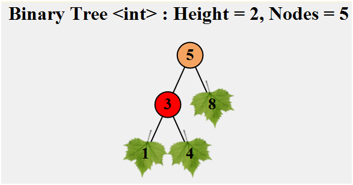

# This is a demo of adding a test project.

1. Going by the book, went very badly (due to the usage of Unit4.dll which requires .Net Framework). See earlier versions of this readme if you want to see details.
2. I ended up bringing in an old unit test project that was created with NUnit framework (that's no longer proposed).
3. So the shortest way to get started is by cloning this project and working on it. 

[Here is the GPT chat](https://chatgpt.com/share/687fcb71-ee74-800e-8cf4-8f5ecca3f73c) 


## First run
When you first run the project you should get this:


---

the project now support creating trees (mainly for testing purposed) using the following syntax:

```csharp
var root = BuildTreeFromVisual(new[] {
    "     5     ",
    "  3     8  ",
    "1  4       "
});
```

or with **line spaces** and this would support test cases like this one:
```
[TestCase(new[] {
    "   10   ",
    "        ",
    " -2  7  "
}, 15, TestName = "TreeWithNegativeValues")]
```
This usage is demonstrated in this test class:
`..\Test3rdTry\BinNode\SumBinaryTreeNodes.cs`